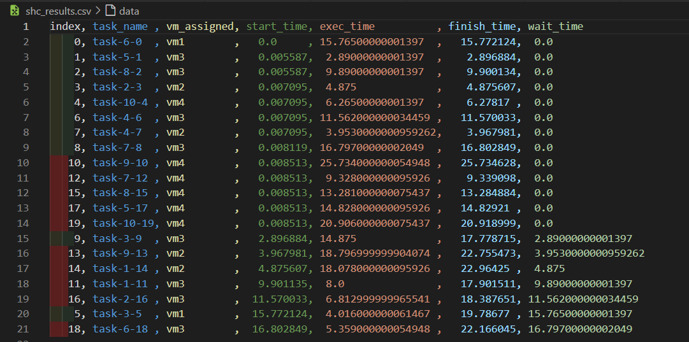
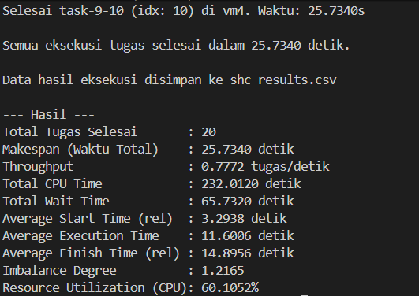

# Pengujian Algoritma Task Scheduler pada Server IT

Repo ini merupakan kode dari server yang digunakan dalam pengujian Task Scheduling pada Server IT serta contoh algoritma scheduler untuk keperluan mata kuliah **Strategi Optimasi Komputasi Awan (SOKA)**.

Saat ini tersedia **empat algoritma penjadwalan** yang dapat digunakan dan dibandingkan:
- **Stochastic Hill Climbing (SHC)** – algoritma awal/bawaan berbasis local search.
- **Particle Swarm Optimization (PSO)** – algoritma swarm-based untuk optimasi makespan.
- **Round Robin (RR)** – algoritma sederhana berbasis giliran bergantian antar VM.
- **First-Come First-Served (FCFS)** – algoritma yang melayani task sesuai urutan kedatangan dengan pemilihan VM berbasis beban (load-aware).

Setiap algoritma bisa diuji dengan beberapa dataset yang tersedia di folder `datasets/` dan hasilnya disimpan per algoritma, per dataset, dan per percobaan.

## Cara Penggunaan - Dev

1. Install `uv` sebagai dependency manager. Lihat [link berikut](https://docs.astral.sh/uv/getting-started/installation/)

2. Install semua requirement

```bash
uv sync
```

3. Buat file `.env` kemudian isi menggunakan variabel pada `.env.example`. Isi nilai setiap variabel sesuai kebutuhan

```conf
VM1_IP=""
VM2_IP=""
VM3_IP=""
VM4_IP=""

VM_PORT=5000
```

4. Algoritma penjadwalan yang tersedia

- **Stochastic Hill Climbing (SHC)**  
  Implementasi terdapat pada file `shc_algorithm.py`.  
  Algoritma ini mencari solusi dengan melakukan perbaikan bertahap pada penugasan task→VM dan hanya menerima solusi tetangga yang lebih baik.

  

- **Particle Swarm Optimization (PSO)**  
  Implementasi terdapat pada file `pso_algorithm.py`.  
  Algoritma ini menggunakan sekumpulan partikel (swarm) yang masing-masing merepresentasikan solusi penjadwalan. Setiap partikel bergerak di ruang solusi dengan mempertimbangkan pengalaman terbaiknya sendiri (pbest) dan terbaik global (gbest) untuk meminimalkan estimasi makespan. Penjelasan lebih detail tersedia di `PSO.md`.

- **Round Robin (RR)**  
  Implementasi terdapat pada file `rr_algorithm.py`.  
  Setiap task secara berurutan dialokasikan ke VM bergantian (vm1, vm2, vm3, vm4, kembali ke vm1, dst.).

- **First-Come First-Served (FCFS)**  
  Implementasi terdapat pada file `fcfs_algorithm.py`.  
  Task dilayani sesuai urutan kedatangan (urutan di dataset). Setiap task yang datang ditempatkan ke VM dengan estimasi waktu selesai paling cepat berdasarkan beban saat ini (cpu_load / cpu_cores).

5. Menjalankan server

Untuk menjalankan server, jalankan Docker:

```bash
docker compose build --no-cache
docker compose up -d
```

Server akan berjalan pada port `5000` (dapat diubah melalui konfigurasi jika diperlukan) dan menyediakan endpoint:
- `GET /health` – untuk pengecekan status server.
- `GET /task/<index>` – untuk mensimulasikan eksekusi task dengan indeks `1-10`.

6. Dataset untuk scheduler

Semua dataset berada di folder `datasets/`. Beberapa dataset yang disediakan:

- `datasets/dataset_random_simple.txt`   → key: `random_simple`
- `datasets/dataset_low_high.txt`        → key: `low_high`
- `datasets/dataset_random_stratified.txt` → key: `random_stratified`

Masih tetap dimungkinkan menggunakan `dataset.txt` di root repo sebagai dataset default.

Format isi dataset berupa angka 1–10 per baris. Contoh:

```txt
6
5
8
2
10
3
4
4
7
3
9
1
7
9
1
8
2
5
6
10
```

7. Menjalankan scheduler

**Catatan:** Pastikan sudah terhubung ke jaringan yang dapat mengakses VM (misal VPN / WiFi ITS).

Format umum pemanggilan scheduler:

```bash
uv run scheduler.py <algoritma> <percobaan> <dataset>
```

- `<algoritma>`: salah satu dari `shc`, `pso`, `rr`, `fcfs`  
  Jika tidak diisi, default = `shc`.
- `<percobaan>`: indeks percobaan (misal `1`, `2`, `3`, ...).  
  Jika tidak diisi, default = `1`.
- `<dataset>` (opsional):
  - Nama pendek yang dikenali scheduler:
    - `random_simple`      → `datasets/dataset_random_simple.txt` → folder hasil: `random-simple`
    - `low_high`           → `datasets/dataset_low_high.txt` → folder hasil: `low-high`
    - `random_stratified`  → `datasets/dataset_random_stratified.txt` → folder hasil: `random-stratified`
  - Atau path langsung ke file dataset (mis. `datasets/dataset_low_high.txt`).
  - Jika tidak diisi, scheduler akan menggunakan `dataset.txt` dan folder hasil bernama `default`.

Contoh:

- Menjalankan **Stochastic Hill Climbing** dengan dataset default (`dataset.txt`):

```bash
uv run scheduler.py              # sama dengan uv run scheduler.py shc 1
uv run scheduler.py shc 1
uv run scheduler.py shc 2        # percobaan ke-2 untuk SHC
```

- Menjalankan **PSO** dengan dataset `random_simple`:

```bash
uv run scheduler.py pso 1 random_simple
uv run scheduler.py pso 2 random_simple
```

- Menjalankan **Round Robin (RR)** dengan dataset `low_high`:

```bash
uv run scheduler.py rr 1 low_high
```

- Menjalankan **FCFS** dengan dataset file tertentu:

```bash
uv run scheduler.py fcfs 1 datasets/dataset_random_stratified.txt
```

8. Struktur hasil eksekusi

Setelah eksekusi sukses, hasil akan disimpan dalam folder `results/` dengan struktur:

```text
results/
  <algoritma>/
    <dataset>/
      <percobaan>.csv
```

Contoh:

```text
results/
  shc/
    default/
      1.csv
      2.csv
    random-simple/
      1.csv
  pso/
    random-simple/
      1.csv
    low-high/
      1.csv
  rr/
    default/
      1.csv
  fcfs/
    dataset_random_stratified/
      1.csv
```

Di console juga akan muncul perhitungan metrik untuk analisis, antara lain:
- Makespan (waktu total)
- Throughput (tugas/detik)
- Total CPU Time
- Total Wait Time
- Average Execution Time
- Imbalance Degree (ketidakseimbangan load antar VM)
- Resource Utilization (utilisasi CPU)

Contoh tampilan hasil lama (format CSV dan console masih relevan, hanya lokasi file yang berubah):yg punya pertanyaan bolehh lah dilanjut gess

`result.csv`



`console`



9. Automasi percobaan dengan `auto-run.bash`

Untuk mempermudah menjalankan banyak percobaan sekaligus, tersedia script `auto-run.bash`.

Pastikan script bisa dieksekusi:

```bash
chmod +x auto-run.bash
```

Format pemanggilan:

```bash
./auto-run.bash <jumlah_percobaan> [algo1 algo2 ...] [-- dataset]
```

- `<jumlah_percobaan>`: banyaknya percobaan per algoritma (wajib).
- `[algo1 algo2 ...]`: daftar algoritma (opsional). Jika tidak diisi, default: `shc pso rr fcfs`.
- `-- dataset` (opsional): nama dataset yang akan diteruskan ke `scheduler.py`, bisa berupa:
  - `random_simple`, `low_high`, `random_stratified` (nama pendek yang dikenali scheduler).
  - path langsung ke file dataset, misalnya `datasets/dataset_low_high.txt`.

Contoh:

```bash
# Jalankan semua algoritma (shc, pso, rr, fcfs) masing-masing 5 kali dengan dataset default (dataset.txt)
./auto-run.bash 5

# Hanya jalankan SHC dan PSO, masing-masing 3 kali dengan dataset random_simple
./auto-run.bash 3 shc pso -- random_simple

# Jalankan RR dan FCFS masing-masing 2 kali dengan dataset_low_high.txt
./auto-run.bash 2 rr fcfs -- datasets/dataset_low_high.txt
```

Hasil dari script ini akan mengikuti struktur: `results/<algo>/<dataset>/<percobaan>.csv`.

10. Membuat grafik perbandingan algoritma

Untuk membandingkan performa algoritma secara visual pada **dataset dan percobaan tertentu**, gunakan script `grapich_comparison.py`.

Format pemanggilan:

```bash
uv run grapich_comparison.py <exp_index> <algo1> [algo2 ...] [-- dataset]
```

- `<exp_index>`: nomor percobaan (mis. `1`).
- `<algo1> [algo2 ...]`: daftar algoritma yang akan dibandingkan (`shc`, `pso`, `rr`, `fcfs`).
- `-- dataset` (opsional): nama dataset (sama aturan seperti di `scheduler.py`). Jika tidak diisi, dianggap `default`.

Contoh:

```bash
# Bandingkan semua algoritma pada percobaan ke-1 dengan dataset default
uv run grapich_comparison.py 1 shc pso rr fcfs

# Bandingkan SHC vs PSO pada percobaan ke-2 dengan dataset random_simple
uv run grapich_comparison.py 2 shc pso -- random_simple

# Bandingkan RR vs FCFS pada percobaan ke-3 dengan dataset_low_high.txt
uv run grapich_comparison.py 3 rr fcfs -- datasets/dataset_low_high.txt
```

Script ini akan membaca file dari:

```text
results/<algo>/<dataset>/<exp_index>.csv
```

Lalu menyimpan gambar ke folder `grapich/<dataset>/` dengan nama:

- `exec_time_comparison_exp_<exp_index>.png`
- `makespan_comparison_exp_<exp_index>.png`
- `vm_load_comparison_exp_<exp_index>.png`

## Hak Cipta / Acknowledgement
Sebagian konten pada repositori ini merupakan turunan atau didasarkan pada garapan dari
[lab-kcks/SOKA-Task-Scheduling-Server-Test](https://github.com/lab-kcks/SOKA-Task-Scheduling-Server-Test).